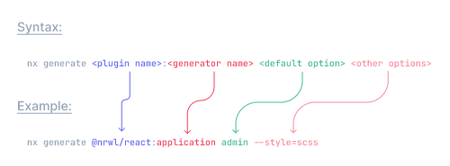

# NX introduction

Within an Nx workspace, you gain many capabilities that help you build applications and libraries using a monorepo approach. If you are currently using an Angular CLI workspace, you can transform it into an Nx workspace.

.png>)

### Creating a New Workspace <a href="#creating-a-new-workspace" id="creating-a-new-workspace"></a>

```
~❯npx create-nx-workspace@latest


 >  NX   Let's create a new workspace [https://nx.dev/getting-started/intro]

✔ Choose what to create                 · angular
✔ Repository name                       · store
✔ Application name                      · store
✔ Default stylesheet format             · css
✔ Enable distributed caching to make your CI faster · No
```

### Creating the application/library

This is an example of CLI commands

<figure><figcaption></figcaption></figure>
